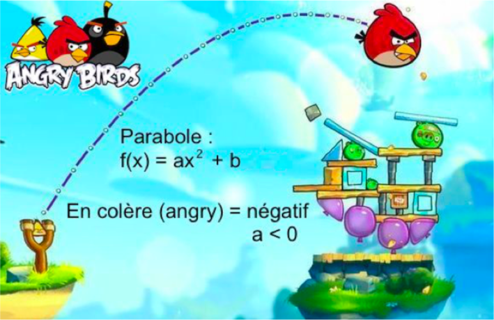
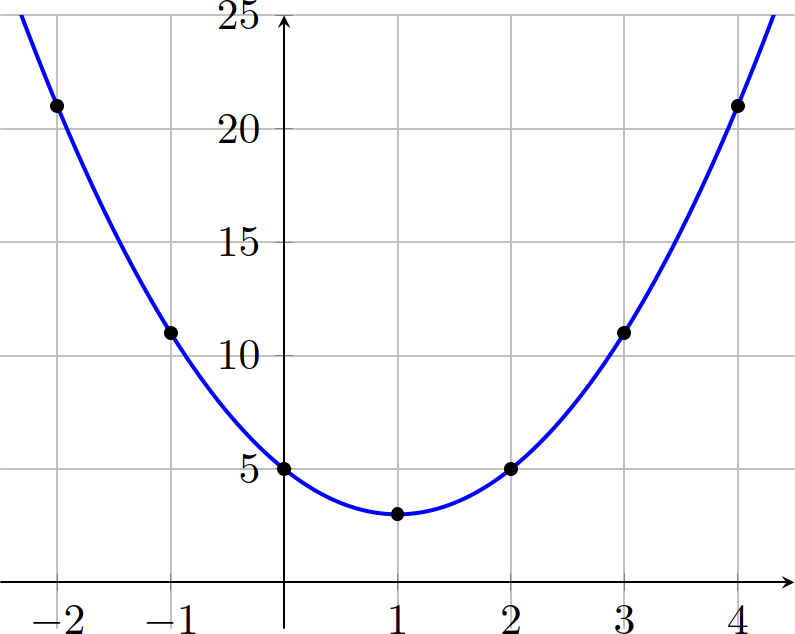
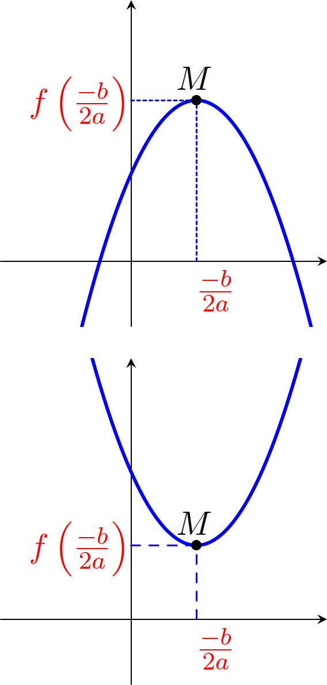
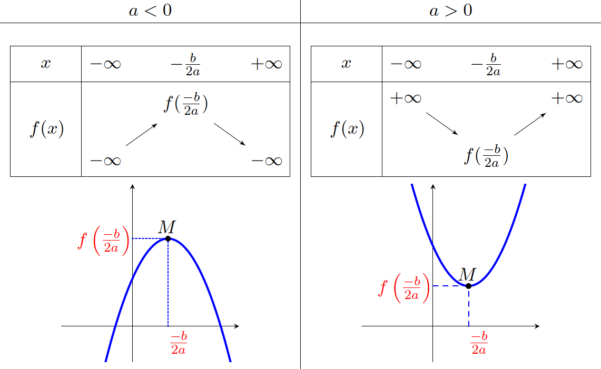
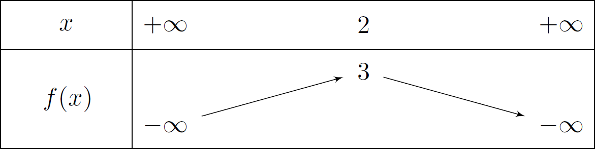
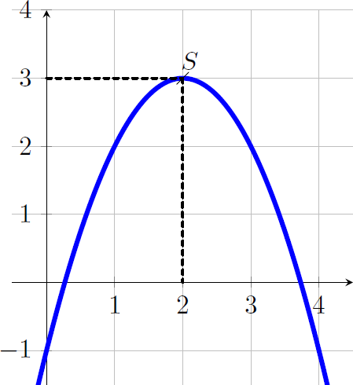

# Fonctions du 2$^\text{nd}$ degré

---

## Définition

On appelle **fonction polynôme de degré 2** toute fonction $f$ définie sur $\mathbb{R}$ par une expression de la forme :

$$f\left( x \right) = ax^{2} + bx + c$$

où les coefficients **a**, **b** et **c** sont des réels donnés avec $a \neq 0$.

### Remarque

Une fonction polynôme de degré 2 s'appelle également fonction **trinôme du second degré** ou par abus de langage **"trinôme"**.

---

### Exemples et contre-exemples

$f\left( x \right) = 3x^{2} - 7x + 3$
> :point_right: Fonction du 2$^\text{nd}$ degré avec $a=3$ , $b=-7$ et $c=3$

$~$

$g\left( x \right) = \dfrac{1}{2}x^{2} - 5x + \dfrac{3}{5}$

> :point_right: Fonction du 2$^\text{nd}$ degré avec $a=\dfrac{1}{2}$ , $b=-5$ et $c=\dfrac{3}{5}$

---

$h\left( x \right) = 4 - 2x^{2}$

> :point_right: Fonction du 2$^\text{nd}$ degré avec $a=-2$ , $b=0$ et $c=4$

$~$

$k\left( x \right) = \left( x - 4 \right)\left( 5 - 2x \right)$

> :point_right: Fonction du 2$^\text{nd}$ degré car :
>
> * $(x-4)(5-2x)=5x-2x^2-20+8x$
>
> Donc $k(x)=-2x^2+13x-20  \Rightarrow a=-2$ , $b=13$ et $c=-20$

---

$m\left( x \right) = 5x - 3$

> :warning: Fonction polynôme de degré 1 (fonction affine).

$~$

$n\left( x \right) = 5x^{4} - 7x^{3} + 3x - 8$

> :warning: Fonction polynôme de degré 4.

---

## Variations et représentation graphique

### Exemple

Soit  $f(x) = 2x^2-4x+5$.

Pour représenter $f$ dans un repère, nous pouvons calculer quelques valeurs de $f(x)$.

* $f(-2)=2\times (-2)^2-4\times (-2)+5=21$
* $f(-1)=2\times (-1)^2-4\times (-1)+5=11$
* $f(0)=2\times (0)^2-4\times (0)+5=5$
* $\ldots$

---

|   $x$  | -2 | -1 | 0 | 1 | 2 |  3 |  4 |
|:------:|:--:|:--:|:-:|:-:|:-:|:--:|:--:|
| $f(x)$ | 21 | 11 | 5 | 3 | 5 | 11 | 21 |

La représentation graphique d'une fonction polynôme de degré 2 est une **parabole**.

---

### Propriété : Minimum et maximum

Soit $f$ une fonction polynôme de degré 2 définie par $f(x) = ax^2+bx+c$, avec $a \neq 0$.

* Si $a > 0$, $f$ admet un **minimum** pour $x=\dfrac{-b}{2a}$.
  * Ce **minimum** est égal à $f\left(\dfrac{-b}{2a}\right)$.
* Si $a < 0$, $f$ admet un **maximum** pour $x=\dfrac{-b}{2a}$.
  * Ce **maximum** est égal à $f\left(\dfrac{-b}{2a}\right)$.

---

On appelle $\alpha$ la valeur $\left(\dfrac{-b}{2a}\right)$ et $\beta$ la valeur $f\left(\dfrac{-b}{2a}\right)$.

$$\boxed{\alpha=\dfrac{-b}{2a}\qquad\beta=f\left(\dfrac{-b}{2a}\right)}$$

---

### Propriété

Variations de $ax^2+bx+c$

---

Il existe un moyen pour se souvenir du résultat précedent

---

### Méthode : Etudier les variations d'une fonction du 2$^\text{nd}$ degré

Soit $f$ définie sur $\mathbb{R}$ par $f\left( x \right) = -x^{2} + 4x - 1$.

On a $\quad a=-1$ , $b=4$ et $c=-1$.

$\alpha=\dfrac{-b}{2a} = \dfrac{-4}{2\times (-1)}= 2\quad$ et $\quad\beta=f(\alpha)=f(2)=-(2)^2+4\times 2 -1 =3$

Le sommet de la parabole est le point $S(2;3)$.

---

$a<0$ donc le tableau de variation de $f$ est :

---

# Forme factorisée

Il se peut que le polynôme du 2$^\text{nd}$ degré ne se présente pas sous la forme **developpée** mais sous une forme **factorisée** comme par exemple :

$$f(x)= (x-1)(x-2)$$

En effet :

$\begin{aligned}
f(x) & = (x-1)(x-2)\\
     & = x^2-2x-1x+2\\
     & = x^2-3x+2\qquad\Rightarrow a=1 \text{ , } b=-3 \text{ et } c=2
\end{aligned}$

---

## Définition

Soit $f$ une fonction définie sur $\mathbb{R}$ tel que : $$f(x)=a(x-x_1)(x-x_2)$$

$f$ est la forme **factorisée** d'une fonction du 2$^\text{nd}$ degré.

$x_1$ et $x_2$ sont les **racines** de $f$

---

### Remarque

les **racines** de $f$ sont solutions de l'équation $f(x)=0$.

$f(x_1) = a(x_1 - x_1)(x_1 - x_2)=0$ et $f(x_2) = a(x_2 - x_1)(x_2 - x_2)=0$.

---

### Exemples

$$f(x)=3(x-1)(x+2)$$

> $f(x)=3(x-1)\left(x- \left(-2\right)\right)$
>
> $f$ est une fonction du 2$^\text{nd}$ degré sous forme factorisée avec $a=3$ , $x_1=1$ et $x_2=-2$

---

$$f(x)=(2x-6)(x-12)$$

> Pour faire apparaître la forme factorisée il faut modifier l'écriture de $(2x-6)$
>
> $(2x-6)=2(x-3)$ donc $f(x)=2(x-3)(x-12)$
>
> $f$ est une fonction du 2$^\text{nd}$ degré avec $a=2$ , $x_1=3$ et $x_2=12$

---

$$f(x)=(3-x)(2x+1)$$

> On a $(3-x)=-(x-3)\quad$ et $\quad(2x+1)=2\left(x+\frac{1}{2}\right)$
>
> Donc $f(x)=-(x-3)\times 2\left(x+\frac{1}{2}\right)=-2(x-3)\left(x+\frac{1}{2}\right)$
>
> $f$ est une fonction du 2$^\text{nd}$ degré avec $a=-2$ , $x_1=3$ et $x_2=-\dfrac{1}{2}$

---

## Propriété : Racines de $f(x)$

Soit $f$ une fonction définie sur $\mathbb{R}$ tel que $f(x)=ax^2+bx+c$ et $x_1$ ,$x_2$ les solutions de l'équation $f(x)=0$.

Alors la forme **factorisée** de $f$ est : $f(x)=a(x-x_1)(x-x_2)$

---

### Exemple

$$f(x)=3(x-1)(x+2)$$

> $f$ est une fonction du 2$^\text{nd}$ degré sous forme factorisée avec $a=3$ , $x_1=1$ et $x_2=-2$.
>
> D'autre part, $f(x)=3\left(x^2 + 2x - 1x -2\right)=3x^2+3x-6$
>
> Donc $x_1=1~$ et $~x_2=-2~$ sont solutions de l'équation $~3x^2+3x-6=0$

---

# Résolution d'équations du 2$^\text{nd}$ degré

Résourdre une équation du 2$^\text{nd}$ degré, c'est résoudre une équation du type $ax^2+bx+c=0$.

---

## Définition : Discriminant

On appelle **discriminant** du trinôme $ax^{2} + bx + c$, le nombre réel, noté $\Delta$, égal à $b^{2} - 4ac$.

$$\boxed{\Delta = b^2-4ac}$$

---

## Propriété : Solutions de $ax^2+bx+c=0$

Soit $\Delta$ le discriminant du trinôme $ax^{2} + bx + c$.

* Si $\Delta < 0$ : L'équation $ax^{2} + bx + c = 0$ n'a **pas de solution réelle**.
* Si $\Delta = 0$ : L'équation $ax^{2} + bx + c = 0$ a **une unique solution** : $\boxed{x_{0}=\dfrac{- b}{2a}}$.

---

* Si $\Delta > 0$ : L'équation $ax^{2} + bx + c = 0$ a **deux solutions distinctes** :

$$\boxed{x_{1} =\dfrac{- b - \sqrt{\Delta}}{2a}\qquad x_{2} =\dfrac{- b + \sqrt{\Delta}}{2a}}$$

---

### Exemple

On cherche à résoudre $2x^{2} - x - 6 = 0$

Calculons le discriminant :

$a=2$, $b=-1$ et $c=-6$ donc

$$\Delta = b^{2} - 4ac = (-1)^{2} - 4\times 2 \times (-6) = 49>0$$

Comme $\Delta > 0$, l'équation possède deux solutions distinctes :

$$x_{1} =\dfrac{- b - \sqrt{\Delta}}{2a}\qquad x_{2} =\dfrac{- b + \sqrt{\Delta}}{2a}$$

---

Calcul de $x_1$ | Calcul de $x_2$
---------|----------
$\begin{aligned}x_{1} &=\dfrac{-b-\sqrt{\Delta}}{2a}\\&=\dfrac{-\left(-1\right)-\sqrt{49}}{2\times 2}\\&=-\dfrac{3}{2}\end{aligned}\qquad$ | $\begin{aligned}x_{2}&=\dfrac{-b+\sqrt{\Delta}}{2a}\\&=\dfrac{-\left(-1\right)+\sqrt{49}}{2\times 2}\\&=2\end{aligned}\qquad$

Les solutions de l'équation $~2x^{2} - x - 6 = 0~$ sont $S=\left\{ -\dfrac{3}{2}~;~2 \right\}$

---

### Exemple

$2x^{2} - 3x + \dfrac{9}{8} = 0$

Calculons le discriminant :

$a=2$, $b=-3$ et $c=\frac{9}{8}$ donc $\quad\Delta = b^{2} - 4ac = (-3)^{2}- 4\times 2 \times \frac{9}{8} = 0$

Comme $\Delta = 0$, l'équation possède une unique solution :

$$x_{0}=-\dfrac{b}{2a}=-\dfrac{-3}{2 \times 2}=\dfrac{3}{4}$$

---

### Exemple

$x^{2} + 3x + 10 = 0$

$a=1$, $b=3$ et $c=10$ donc
$$\Delta = b^{2} - 4ac = 3^{2} - 4 \times 1 \times 10 = -31$$

Comme $\Delta < 0$, l'équation ne possède pas de solution réelle.

---

### Propriété

La somme *S* et le produit *P* des **racines** d’un polynôme du 2$^\text{nd}$ degré de la forme $ax^{2} + bx + c = 0$ sont donnés par :

$$S=-\dfrac{b}{a}\qquad P=\dfrac{c}{a}$$

---

### Démonstration

Soit $x_1$ et $x_2$ les solutions de $x^2+bx+c=0$ alors
$$x_{1}=\dfrac{-b-\sqrt{\Delta}}{2a}\qquad x_{2}=\dfrac{-b+\sqrt{\Delta}}{2a}$$

Donc, la somme des **racines** est $S=x_1 + x_2$ :

$\begin{aligned}
S & = x_1 + x_2\\
  & = \dfrac{-b-\sqrt{\Delta}}{2a}+\dfrac{-b+\sqrt{\Delta}}{2a}\\
  & = \dfrac{(-b-\sqrt{\Delta})+(-b+\sqrt{\Delta})}{2a}= \dfrac{-2b}{2a} = \dfrac{-b}{a}
\end{aligned}$

---

Le produit des **racines** est $P=x_1 \times x_2$ :

$\begin{aligned}
P & = x_1 \times x_2\\
  & = \dfrac{-b-\sqrt{\Delta}}{2a} \times \dfrac{-b+\sqrt{\Delta}}{2a} = \dfrac{(-b-\sqrt{\Delta})\times(-b+\sqrt{\Delta})}{2a\times 2a}\\
  & = \dfrac{ (-b)^2 + \left((-b) \times \sqrt{\Delta}\right) + \left(\left(-\sqrt{\Delta}\right) \times (-b)\right) + \left(\left(-\sqrt{\Delta}\right) \times \sqrt{\Delta}\right) }{4a^2}\\
  & = \dfrac{b^2 - \Delta}{4a^2} = \dfrac{b^2 - (b^2-4ac)}{4a^2} = \dfrac{4ac}{4a^2} = \dfrac{c}{a}
\end{aligned}$

---

## Propriété : Forme factorisée de $ax^2+bx+c$

Soit $f$ une fonction polynôme de degré $2$ définie sur par $f\left( x \right) = ax^{2} + bx + c$.

- Si $\Delta = 0$ : Pour tout réel $x$, on a : $f\left( x \right) = a\left( x - x_{0} \right)^{2}$.

- Si $\Delta > 0$ : Pour tout réel $x$, on a : $f\left( x \right) = a\left( x - x_{1} \right)\left( x - x_{2} \right)$.

### Remarque

Si $\Delta < 0$, il n’existe pas de forme factorisée de $f$.

---

### Méthode : Factoriser un trinôme

Factoriser le trinôme suivant : ${4x}^{2} + 19x - 5$

> On cherche les racines du trinôme ${4x}^{2} + 19x - 5$
>
> On a $a=4$ , $b=19$ et $c=-5$ donc
> $$\Delta = 19^2 - 4 \times 4 \times (-5) = 441$$

---

> Les racines du trinôme sont :

Calcul de $x_1$ | Calcul de $x_2$
-|-
$\begin{aligned}x_{1} & = \dfrac{-19 - \sqrt{441}}{2 \times 4}\\& = -5\end{aligned}\qquad$ | $\begin{aligned}x_{2} & = \dfrac{- 19 + \sqrt{441}}{2 \times 4}\\ & = \dfrac{1}{4}\end{aligned}\qquad$

> On a donc :
> $\begin{aligned}
{4x}^{2}+19x-5 & = 4\left(x-\left(-5\right)\right)\left(x-\frac{1}{4}\right)\\
               & = 4\left(x+5\right)\left(x-\frac{1}{4}\right) \quad=\quad (x+5)(4x-1)
\end{aligned}$

---

> Une vérification à l'aide de la calculatrice n'est jamais inutile \! On peut lire une valeur approchée des racines sur l'axe des abscisses.

$x_1$ | $x_2$
---------|----------
 | 

---

### Exemple

Factoriser le trinôme suivant : ${9x}^{2} - 6x + 1$

> On cherche les racines du trinôme ${9x}^{2} - 6x + 1$
> On a $a=9$ , $b=-6$ et $c=1$ donc $\Delta = (-6)^2 - 4 \times 9 \times (1) = 0$
> La racine du trinôme est : $x_{0} = \dfrac{-(-6)}{2 \times 9} = \dfrac{1}{3}$
> On a donc : ${9x}^{2}-6x+1=9\left(x-\dfrac{1}{3}\right)^2$

---

## Propriété : Les différentes représentations possibles de $f$

En fonction du signe de $a$ et de $\Delta$, nous pouvons en déduire les représentations de $f$.

> Pour $a>0$

| $\Delta>0$  | $\Delta=0$ | $\Delta<0$ |
|:--:|:--:|:--:|
|  |  |  |

---

> Pour $a<0$

| $\Delta>0$  | $\Delta=0$ | $\Delta<0$ |
|:--:|:--:|:--:|
|  |  |  |

---

# Forme canonique

## Définition : Forme canonique

Toute fonction polynôme $f$ de degré 2 définie sur $\mathbb{R}$ par $f\left( x \right) = ax^{2} + bx + c$ peut s'écrire sous la forme :

$$f\left( x \right) = a\left( x - \alpha \right)^{2} + \beta$$

où $\alpha$ et $\beta$ sont deux nombres réels.

Cette dernière écriture s'appelle la **forme canonique** de $f$.

---

### Exemple

$f(x)=2(x-1)^2+3$ est une fonction du 2$^\text{nd}$ degré sous forme **canonique** avec $a=2$ , $\alpha=1$ et $\beta=3$.

> En effet,
>
> $\begin{aligned}f(x) & = 2(x-1)^2+3 \\ & = 2(x^2-2x+1)+3 \\ & = 2x^2-4x+2+3 = 2x^2-4x+5\end{aligned}$
> Donc $a=2~$ , $~b=-4~$ et $~c=5$

---

### Méthode : Déterminer la forme canonique d'une fonction du 2$^\text{nd}$ degré

Soit la fonction $f$ définie sur $\mathbb{R}$ par : $f\left( x \right) = 2x^{2} - 20x + 10$. On veut exprimer la fonction $f$ sous sa forme canonique.

---

$\begin{aligned}
f\left(x\right) & = 2x^{2}-20x+10\\
                & = 2\left\lbrack x^{2}-10x\right\rbrack+10\\
                & = 2\left\lbrack x^{2}-10x+25-25\right\rbrack+10\\
                & = 2\left\lbrack\left(x-5\right)^{2}-25\right\rbrack+10\\
                & = 2\left(x-5\right)^{2}-50+10\\
                & = 2\left(x-5\right)^{2}-40
\end{aligned}$

On a donc $\alpha=5$ et $\beta=-40$

$f(x) = 2\left( x - 5 \right)^{2} - 40$ est la forme **canonique** de $f$.

---

### Démonstration

$\begin{aligned}
f\left( x \right) & =  ax^{2} + bx + c \\
                  & =  a\left\lbrack x^{2}+\frac{b}{a}x\right\rbrack + c\\
                  & =  a\left\lbrack x^{2}+\frac{b}{a}x+\left(\frac{b}{2a}\right)^{2}-\left(\frac{b}{2a}\right)^{2}\right\rbrack + c\\
                  & =  a\left\lbrack \left( x + \frac{b}{2a} \right)^{2} - \left( \frac{b}{2a} \right)^{2} \right\rbrack + c \\
\end{aligned}$

---

$\begin{aligned}
f\left( x \right) & =  a\left( x + \frac{b}{2a} \right)^{2} - a\frac{b^{2}}{4a^{2}} + c\\
              &= a\left( x + \frac{b}{2a} \right)^{2} - \frac{b^{2}}{4a} + c \\
                  & =  a\left( x + \frac{b}{2a} \right)^{2} - \frac{b^{2} - 4ac}{4a}\\
                  &= a\left( x - \alpha \right)^{2} + \beta
\end{aligned}$

avec $\alpha = -\dfrac{b}{2a}\quad$ et $\quad\beta = f(\alpha) = - \dfrac{b^{2} - 4ac}{4a}$.

---

### Remarque

Pour écrire un trinôme sous sa forme canonique, il est possible d’utiliser les deux dernières formules donnant $\alpha$ et $\beta$.

$$\alpha = -\dfrac{b}{2a}\qquad\beta = f(\alpha) = - \dfrac{b^{2} - 4ac}{4a}$$

---

### Méthode : Déterminer la forme canonique d'une fonction du 2$^\text{nd}$ degré

Soit la fonction $f$ définie sur $\mathbb{R}$ par : $f\left( x \right) = 2x^{2} - 20x + 10$.

On veut exprimer la fonction $f$ sous sa forme canonique.

On a $~a=2$ , $~b=-20~$ et $~c=10~$ donc

$$\begin{aligned}
\alpha & = -\dfrac{b}{2a}\\
       & = -\dfrac{-20}{2\times 2} = 5
\end{aligned}$$

---

Calculons $\beta$ :

$$\begin{aligned}
\beta & = f(\alpha) \\
      & = 2\times 5^{2} - 20\times 5 + 10\\
      & = 50-100+10 = 40
\end{aligned}$$

On a donc $\alpha=5\quad$ et $\quad\beta=-40\quad$  donc $\quad f(x) = 2\left( x - 5 \right)^{2} - 40$

---

### Exemple

Soit la fonction $f$ donnée sous sa forme canonique par : $f\left( x \right) = 2\left( x - 1 \right)^{2} + 3$

On a :

$\begin{aligned}
  & \left( x - 1 \right)^{2} > 0 \\
\Leftrightarrow\quad & 2\left( x - 1 \right)^{2} >  0 \\
\Leftrightarrow\quad & 2\left( x - 1 \right)^{2} +3 > 3 \quad\Leftrightarrow\quad f(x) > 3 \\
\end{aligned}$

Or $f\left( 1 \right) = 3~$ donc $~f\left( x \right) \geq f(1)$.

$f$ admet donc un minimum en $x=1$. Ce minimum est égal à $3$.

---

## Propriété : Minimum et maximum

Soit $f$ une fonction polynôme de degré 2 définie par $f(x) = a\left( x - \alpha \right)^{2} + \beta$

* Si $a > 0$, $f$ admet un minimum pour $x = \alpha$. Ce minimum est égal à $\beta$.
* Si $a < 0$, $f$ admet un maximum pour$\ x = \alpha$. Ce maximum est égal à $\beta$.

### Remarque

On peut retenir que $f$ admet un maximum (ou un minimum) pour $x = -\dfrac{b}{2a}$

---

### Méthode : Déterminer les caractéristiques d’une parabole

Déterminer l’axe de symétrie et le sommet de la parabole d’équation

$$y = 2x^{2} - 12x + 1$$

* La parabole possède un axe de symétrie d'équation $x = -\frac{b}{2a}$

$$x = -\frac{- 12}{2 \times 2} = 3$$

La droite d’équation $x = 3$ est donc axe de symétrie de la parabole.

---

Les coordonnées de son sommet sont : $\left( - \frac{b}{2a}\ ;\ f\left( - \frac{b}{2a} \right) \right)$, soit : 

$$\left( 3\ ;2 \times 3^{2} - 12 \times 3 + 1 \right) = \left( 3\ ;\  - 17 \right)$$

Le point $\left( 3\ ;\  - 17 \right)$ est le sommet de la parabole.

$a = 2 > 0$, ce sommet correspond à un minimum.

---

### Démonstration : Solutions de l'équation $ax^2+bx+c=0$

La fonction $f$ définie sur $\mathbb{R}$ par $f\left( x \right) = ax^{2} + bx + c$ peut s'écrire sous sa forme canonique :

$f(x) = a\left( x - \alpha \right)^{2} + \beta$ avec $\alpha = -\frac{b}{2a}$ et $\beta =- \frac{b^{2} - 4ac}{4a}$.

Donc :

$ax^{2} + bx + c = 0$ peut s’écrire :

---

$\begin{aligned}
a\left( x + \frac{b}{2a} \right)^{2} - \frac{b^{2} - 4ac}{4a}  & = 0 \\
     a\left( x + \frac{b}{2a} \right)^{2} - \frac{\Delta}{4a}  & = 0 \\
                         a\left( x + \frac{b}{2a} \right)^{2}  & = \frac{\Delta}{4a} \\
                          \left( x + \frac{b}{2a} \right)^{2}  & = \frac{\Delta}{4a^{2}} \text{\quad car  } a \neq 0
\end{aligned}$

---

* Si $\Delta < 0$ :
Comme un carré ne peut être négatif $\left( \frac{\Delta}{4a^{2}} < 0 \right)$, l'équation $ax^{2} + bx + c = 0$ n'a pas de solution.

* Si $\Delta = 0$ :
L'équation $ax^{2} + bx + c = 0$ peut s'écrire : $\left( x + \frac{b}{2a} \right)^{2} = 0$
L'équation n'a qu'une seule solution : $x = \frac{-b}{2a}$

---

- Si $\Delta > 0$ : L'équation $ax^{2} + bx + c = 0$ est équivalente à :

Solution n°1 | Solution n°2
---------|----------
$\begin{aligned}x + \frac{b}{2a} & = +\sqrt{\frac{\Delta}{4a^{2}}} \\ x & = +\sqrt{\frac{\Delta}{4a^{2}}} - \frac{b}{2a} \\ x & = \frac{+\sqrt{\Delta}}{2a} - \frac{b}{2a} \\ x & = \frac{+\sqrt{\Delta}-b}{2a}  = \frac{-b+\sqrt{\Delta}}{2a}\end{aligned}$ | $\begin{aligned}x + \frac{b}{2a}  & = -\sqrt{\frac{\Delta}{4a^{2}}} \\x  & = -\sqrt{\frac{\Delta}{4a^{2}}} - \frac{b}{2a} \\x  & = \frac{-\sqrt{\Delta}}{2a} - \frac{b}{2a} \\x  & = \frac{-\sqrt{\Delta}-b}{2a}  = \frac{-b-\sqrt{\Delta}}{2a}\end{aligned}$

---

L'équation a deux solutions distinctes :

$$x_1 = \dfrac{-b+\sqrt{\Delta}}{2a}\qquad x_2 = \dfrac{-b-\sqrt{\Delta}}{2a}$$
