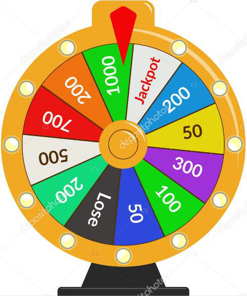
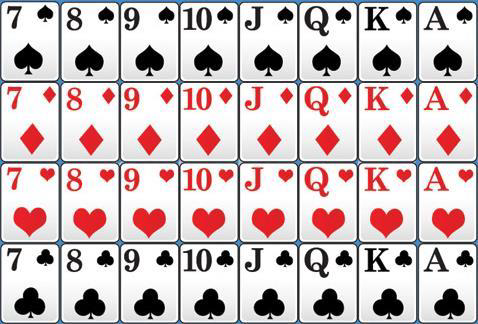

# Probabilité conditionnelle

---

# Rappels : Probabilités

## Vocabulaire

* Une expérience aléatoire : "Lancer la roue"
* Une issue : $50$ ; $1000$ ou Jackpot
* Un univers : L’ensemble des issues possibles

$$\Omega=\left\{\text{LOSE};50;100;200;300;500;700;1000;\text{JACKPOT}\right\}$$

* Un événement : Un ensemble d’issues

$$A : "\text{Obtenir −de 450€}"\qquad 𝐴=\left\{\text{LOSE};50;100;200;300\right\}$$

---

## Événements et probabilité

La probabilité d'un événement et la somme des probabilités des issues qui le composent.

$A : "\text{Obtenir −de 450€}"\qquad 𝐴=\left\{\text{LOSE};50;100;200;300\right\}$

$\begin{aligned}
P(A)&=P(\text{LOSE})&+&P(50)&+&P(100)&+&P(200)&+&P(300)\\
~   &=\dfrac{1}{12}&+&\dfrac{2}{12}&+&\dfrac{1}{12}&+&\dfrac{3}{12}&+&\dfrac{1}{12}\\
&=\dfrac{8}{12}
\end{aligned}$

---

* Équiprobabilité : Si la probabilité de chaque issues sont égales
  * Un lancer de dé non truqué où chaque issue est le nombre indiqué par le dé.
  * Un choix au hasard d'une personne parmi une population donnée.
* Loi de probabilité : tableau résumant la probabbilité de toutes les issues

Issue | LOSE | 50 | 100 | 200 | 300 | 500 | 700 | 1000 | JACKPOT
---:|:---:|:---:|:---:|:---:|:---:|:---:|:---:|:---:|:---:
Probabilité | $\frac{1}{12}$ |$\frac{2}{12}$ |$\frac{1}{12}$ |$\frac{3}{12}$ |$\frac{1}{12}$ |$\frac{1}{12}$ |$\frac{1}{12}$ |$\frac{1}{12}$ |$\frac{1}{12}$ |

---

* Somme des probabilités de chaque issue de l'univers est égale à 1
$$P(\text{LOSE})+P(50)+P(50)+\ldots+P(\text{JACKPOT})=1$$
* Événement contraire :
  * $A$ : "Gagner moins de 450€"
  * $\overline{A}$ : "Gagner plus de 450€"
$$P(\overline{A})=1-P(A)$$

---

* Intersection : $A\cap B\qquad$ C'est l'événement $A$ **et** $B$
* Union : $A\cup B\qquad$ C'est l'événement $A$ **ou** $B$

$$P(A\cup B) = P(A) + P(B) - P(A\cap B)$$

### Exemple

* $A$ : "Gagner moins de 450€" $\qquad B$ : "Gagner plus de 150€"
* $A=\left\{\text{LOSE};50;100;200;300\right\}$
* $B=\left\{200;300;500;700;\text{JACKPOT}\right\}$

---

* $A=\left\{\text{LOSE};50;100;200;300\right\}$
* $B=\left\{200;300;500;700;\text{JACKPOT}\right\}$
* $A\cap B$ : "Gagner moins de 450€ **et** Gagner plus de 150€"
  * $A\cap B = \left\{200;300\right\}$
$$P(A\cap B)=P("200")+P("300")=\frac{3}{12}+\frac{1}{12}=\frac{4}{12}=\frac{1}{3}$$

---

# Probabilité conditionnelle

## Définition

Soit $A$ et $B$ deux événements avec $P(A)\neq0$.

On appelle **probabilité conditionnelle de B sachant A**, la probabilité que l'événement $B$ se réalise sachant que l'événement $A$ est réalisé

Elle est notée $~P_A(B)~$ et est définie par :

$$P_A(B)=\frac{P(A\cap B)}{P(A)}$$

---

### Exemple

On tire au hasard une carte dans un jeu de 32 cartes.

* Soit A l’événement "La carte est un pique"
  * $P(A)=\frac{8}{12}$
* Soit B l’événement "La carte est un roi"
  * $P(B)=\frac{4}{12}$
* $A\cap B~$ est l’événement "La carte est le roi de pique"
  * $P(A\cap B)=\frac{1}{12}$

---

La probabilité que la carte soit un roi **sachant que** l’on a tiré un pique est :

$$P_A(B)=\frac{P(A\cap B)}{P(A)}=\frac{\frac{1}{12}}{\frac{8}{12}}=\frac{1}{8}$$

On peut retrouver intuitivement ce résultat. En effet, **sachant que le résultat est un pique**, on a une chance sur 8 d'obtenir le roi.

---

### Exemple

Un sac contient 50 boules, dont 20 boules rouges et 30 boules noires, où il est marqué soit "Gagné" ou soit "Perdu".

* Sur 15 boules rouges, il est marqué Gagné
* Sur 9 boules noires, il est marqué Gagné

On tire au hasard une boule dans le sac :

* Soit $R$ l'événement "On tire une boule rouge"
* Soit $G$ l'événement "On tire une boule marquée Gagné"
* $R\cap G$ est l'événement "On tire une boule rouge marquée Gagné"

---

On a :

* $P(R)=\frac{20}{50}=0.4\quad$ et $\quad P(R\cap G)=\frac{15}{50}=0.3$

Donc la probabilité qu'on tire une boule marquée Gagné **sachant qu'elle est rouge** :

$$P_R(G)=\frac{P(R\cap G)}{P(R)}=\frac{0.3}{0.4}=0.75$$

En effet, **sachant que le résultat est une boule rouge**, on a 15 chances sur 20 qu'il soit marqué Gagné $\left(\frac{15}{20}=0.75\right)$

---

### Remarque

La probabilité conditionnelle suit les règles vues plus haut

## Propriétés

Soit A et B, deux événements avec $P(A)\neq0$

* $0\leq P_A(B)\leq 1$
* $P_A(\overline{B})=1-P_A(B)$
* $P(A\cap B)=P_A(B)\times P(A)$

---

A FIRNIR

---
# Arbres pondérés et tableaux de probabilités

## Arbres pondérés

## Probabilité totale

## Tableaux de probabilités

---

# Probabilité et indépendance
